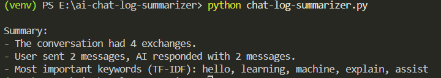

# AI Chat Log Summarizer
## Project Description
This Python-based tool reads `.txt` chat logs between a user and an AI, parses the conversation, and produces a simple summary including:
- Total number of message exchanges
- Count of messages from User vs. AI
- Most frequently used keywords (excluding common stop words)
- Nature of the conversation based on keyword topics
This project demonstrates basic Natural Language Processing (NLP) capabilities using Python and a TF-IDF approach for keyword extraction.
## Features

- Parses chat logs formatted with lines starting with `User:` and `AI:`
- Supports summarization of a single chat log file
- Counts total messages and messages by each speaker
- Extracts top 5 keywords using TF-IDF, excluding common stop words
- Outputs a clear, readable summary for each chat log
## How to Run
1. **Clone the repository:**
    ```bash
   git clone https://github.com/taralamia/ai-chat-log-summarizer.git
   cd ai-chat-log-summarizer
2. **Set up a Python virtual environment :** 
    ```bash
    python -m venv venv
    # On Windows
    venv\Scripts\activate
    # On macOS/Linux
    source venv/bin/activate
    ```
3. **Install dependencies:**
    ```bash
    pip install -r requirements.txt
    ```
4. **Run the summarizer on your chat log file (e.g., `chat.txt`):**
    ```bash
    python chat-log-summarizer.py chat.txt 
    ```
## Sample Output
Here is a screenshot of the summarizer output in the terminal:

